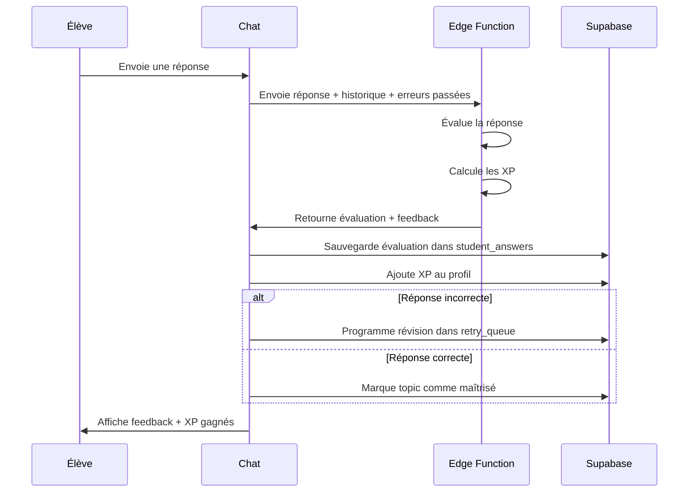

# 🎯 Système d'Évaluation Intelligent & XP Adaptatifs

## 📊 PRINCIPE GÉNÉRAL

L'IA doit :
1. **Évaluer chaque réponse** de l'élève (correcte, partiellement correcte, incorrecte)
2. **Attribuer des XP** selon la qualité de la réponse
3. **Mémoriser les erreurs** pour reposer les questions plus tard
4. **Adapter la difficulté** selon les performances

---

## 🧠 SYSTÈME D'ÉVALUATION DES RÉPONSES

### Structure de Données : `student_answers` (Nouvelle table)

```sql
CREATE TABLE student_answers (
  id UUID PRIMARY KEY DEFAULT uuid_generate_v4(),
  student_id UUID REFERENCES students(id) ON DELETE CASCADE,
  session_id UUID REFERENCES chat_sessions(id) ON DELETE CASCADE,
  message_id UUID REFERENCES chat_messages(id) ON DELETE CASCADE,
  
  -- Question posée par l'IA
  question TEXT NOT NULL,
  question_topic TEXT, -- Ex: "Théorème de Pythagore", "Accord du participe passé"
  question_difficulty TEXT, -- 'easy', 'medium', 'hard'
  
  -- Réponse de l'élève
  student_answer TEXT NOT NULL,
  
  -- Évaluation par l'IA
  evaluation TEXT NOT NULL, -- 'correct', 'partial', 'incorrect'
  evaluation_details JSONB, -- { reasoning: "...", mistakes: [...], strengths: [...] }
  
  -- Récompense
  xp_awarded INTEGER DEFAULT 0,
  
  -- Suivi
  retry_count INTEGER DEFAULT 0, -- Nombre de fois que la question a été reposée
  mastered BOOLEAN DEFAULT FALSE, -- TRUE si l'élève a finalement réussi
  
  created_at TIMESTAMP DEFAULT NOW()
);

CREATE INDEX idx_student_answers_student ON student_answers(student_id);
CREATE INDEX idx_student_answers_topic ON student_answers(question_topic);
CREATE INDEX idx_student_answers_evaluation ON student_answers(evaluation);
CREATE INDEX idx_student_answers_mastered ON student_answers(mastered);
```

---

## 🎓 ATTRIBUTION DES XP SELON LA QUALITÉ

### Barème XP par Type de Réponse

```typescript
const XP_REWARDS = {
  // Réponse correcte du premier coup
  correct_first_try: {
    easy: 10,
    medium: 20,
    hard: 30
  },
  
  // Réponse correcte après 1 erreur
  correct_second_try: {
    easy: 5,
    medium: 10,
    hard: 15
  },
  
  // Réponse correcte après 2+ erreurs
  correct_after_retries: {
    easy: 3,
    medium: 5,
    hard: 8
  },
  
  // Réponse partiellement correcte
  partial: {
    easy: 3,
    medium: 5,
    hard: 10
  },
  
  // Bonus pour série de bonnes réponses
  streak_bonus: {
    3: 10,   // 3 bonnes réponses d'affilée
    5: 25,   // 5 bonnes réponses d'affilée
    10: 50   // 10 bonnes réponses d'affilée
  }
};
```

### Exemples Concrets

**Scénario 1 : Réponse correcte du premier coup**
```
IA: "Quel est le résultat de 3² + 4² ?"
Élève: "25"
IA: "✅ Excellent ! C'est bien 25 (9 + 16). +20 XP 🌟"

→ Sauvegarde: evaluation='correct', xp_awarded=20, retry_count=0
```

**Scénario 2 : Réponse incorrecte puis correcte**
```
IA: "Quel est le résultat de 3² + 4² ?"
Élève: "49"
IA: "🔍 Pas tout à fait... Tu as calculé (3+4)², mais il faut d'abord calculer 3² et 4² séparément. Réessaie !"

Élève: "25"
IA: "✅ Parfait ! Tu as corrigé ton erreur. +10 XP 🌟"

→ Sauvegarde: evaluation='correct', xp_awarded=10, retry_count=1
```

**Scénario 3 : Réponse partiellement correcte**
```
IA: "Explique le théorème de Pythagore"
Élève: "C'est a² + b² = c²"
IA: "⚡ Bonne formule ! Mais peux-tu préciser ce que représentent a, b et c ? +5 XP"

→ Sauvegarde: evaluation='partial', xp_awarded=5
```

---

## 🔄 SYSTÈME DE RÉVISION DES ERREURS

### Mémorisation des Erreurs

Quand l'élève fait une erreur, l'IA :
1. **Enregistre l'erreur** dans `student_answers`
2. **Marque le topic** comme "à revoir"
3. **Programme une révision** pour plus tard

### Stratégie de Répétition Espacée

```typescript
const RETRY_SCHEDULE = {
  // Délai avant de reposer la question selon le nombre d'erreurs
  first_error: 5,      // 5 minutes
  second_error: 30,    // 30 minutes
  third_error: 1440,   // 24 heures
  fourth_error: 10080  // 7 jours
};

async function scheduleRetry(studentId: string, topic: string, errorCount: number) {
  const delayMinutes = RETRY_SCHEDULE[`${errorCount}_error`] || 10080;
  const retryAt = new Date(Date.now() + delayMinutes * 60 * 1000);
  
  await supabase.from('retry_queue').insert({
    student_id: studentId,
    topic: topic,
    retry_at: retryAt.toISOString(),
    priority: errorCount // Plus d'erreurs = priorité plus haute
  });
}
```

### Intégration dans le Chat

**Prompt système enrichi :**
```typescript
const buildSystemPrompt = (context: MentorContext) => {
  let prompt = BASE_PROMPT;
  
  // Récupérer les erreurs récentes de l'élève
  const recentErrors = await getRecentErrors(context.studentId);
  
  if (recentErrors.length > 0) {
    prompt += `\n\n⚠️ POINTS FAIBLES DÉTECTÉS (repose ces questions) :\n`;
    recentErrors.forEach(error => {
      prompt += `- ${error.question_topic} : L'élève a fait ${error.retry_count} erreur(s). `;
      prompt += `Dernière erreur : "${error.student_answer}". `;
      prompt += `Raison : ${error.evaluation_details?.reasoning}\n`;
    });
    prompt += `\nREPOSE ces questions de manière différente pour vérifier si l'élève a compris.\n`;
  }
  
  // Récupérer les points forts
  const strengths = await getStrengths(context.studentId);
  
  if (strengths.length > 0) {
    prompt += `\n\n✅ POINTS FORTS (l'élève maîtrise) :\n`;
    strengths.forEach(s => {
      prompt += `- ${s.topic} : ${s.success_rate}% de réussite\n`;
    });
    prompt += `\nTu peux augmenter la difficulté sur ces sujets.\n`;
  }
  
  return prompt;
};
```

---

## 🎯 FONCTION D'ÉVALUATION PAR L'IA

### Modification de l'Edge Function `/chat`

**Ajout dans le prompt système :**
```typescript
const EVALUATION_INSTRUCTION = `
ÉVALUATION DES RÉPONSES (OBLIGATOIRE) :

Après chaque réponse de l'élève à une question, tu DOIS :

1. **Évaluer la réponse** :
   - ✅ CORRECT : Réponse juste et complète
   - ⚡ PARTIAL : Réponse partiellement correcte (manque des détails)
   - ❌ INCORRECT : Réponse fausse

2. **Retourner un objet JSON** dans ta réponse :
{
  "evaluation": "correct" | "partial" | "incorrect",
  "reasoning": "Explication de ton évaluation",
  "mistakes": ["erreur 1", "erreur 2"], // Si incorrect/partial
  "xp_awarded": 20, // Selon le barème
  "question_topic": "Théorème de Pythagore",
  "question_difficulty": "medium"
}

3. **Adapter ton feedback** :
   - Si CORRECT : Félicite et donne les XP
   - Si PARTIAL : Encourage et demande de préciser
   - Si INCORRECT : Explique l'erreur SANS donner la réponse, guide vers la solution

4. **Reposer les questions** où l'élève a fait des erreurs lors des sessions précédentes.

EXEMPLE :
Élève : "Le cœur a 2 ventricules"
Réponse IA : "✅ Exact ! Le cœur possède bien 2 ventricules. +10 XP 🌟"
JSON : { "evaluation": "correct", "xp_awarded": 10, "question_topic": "Anatomie du cœur", "question_difficulty": "easy" }
`;
```

### Traitement de la Réponse IA

**Dans `chatStore.ts` :**
```typescript
const resp = aiResponse as {
  content?: string;
  evaluation?: {
    evaluation: 'correct' | 'partial' | 'incorrect';
    reasoning: string;
    mistakes?: string[];
    xp_awarded?: number;
    question_topic?: string;
    question_difficulty?: 'easy' | 'medium' | 'hard';
  };
  // ... autres champs
};

// Si l'IA a évalué la réponse
if (resp.evaluation) {
  // Sauvegarder l'évaluation
  await supabase.from('student_answers').insert({
    student_id: studentId,
    session_id: sessionId,
    message_id: savedMessage.id,
    question: messages[messages.length - 2]?.content || '', // Question précédente
    student_answer: content,
    evaluation: resp.evaluation.evaluation,
    evaluation_details: {
      reasoning: resp.evaluation.reasoning,
      mistakes: resp.evaluation.mistakes || []
    },
    xp_awarded: resp.evaluation.xp_awarded || 0,
    question_topic: resp.evaluation.question_topic,
    question_difficulty: resp.evaluation.question_difficulty
  });
  
  // Ajouter les XP à l'élève
  if (resp.evaluation.xp_awarded > 0) {
    await addXP(studentId, resp.evaluation.xp_awarded, `Bonne réponse : ${resp.evaluation.question_topic}`);
  }
  
  // Si erreur, programmer une révision
  if (resp.evaluation.evaluation === 'incorrect') {
    const errorCount = await getErrorCount(studentId, resp.evaluation.question_topic);
    await scheduleRetry(studentId, resp.evaluation.question_topic, errorCount);
  }
  
  // Si correct, marquer comme maîtrisé si c'était une révision
  if (resp.evaluation.evaluation === 'correct') {
    await markAsMastered(studentId, resp.evaluation.question_topic);
  }
}
```

---

## 📈 DASHBOARD DE PROGRESSION

### Nouvelles Métriques à Afficher

**Dans le profil de l'élève :**
```
┌─────────────────────────────────────────────────┐
│  📊 MES STATISTIQUES                           │
│                                                 │
│  🎯 Taux de réussite global : 78%              │
│  ├─ Maths : 85% (Fort)                         │
│  ├─ Français : 72% (Moyen)                     │
│  └─ SVT : 65% (À travailler)                   │
│                                                 │
│  🔥 Série actuelle : 5 bonnes réponses         │
│  🏆 Meilleure série : 12 bonnes réponses       │
│                                                 │
│  ⚠️ Points à revoir (3)                        │
│  ├─ Théorème de Pythagore (2 erreurs)         │
│  ├─ Accord du participe passé (1 erreur)      │
│  └─ Photosynthèse (3 erreurs)                 │
│                                                 │
│  ✅ Notions maîtrisées : 24/45                 │
└─────────────────────────────────────────────────┘
```

---

## 🔄 FLUX COMPLET D'UNE QUESTION-RÉPONSE



---

## 🎮 GAMIFICATION AVANCÉE

### Système de Séries (Streaks)

```typescript
interface Streak {
  current: number;      // Série actuelle
  best: number;         // Meilleure série
  last_answer_date: string;
}

async function updateStreak(studentId: string, isCorrect: boolean) {
  const streak = await getStreak(studentId);
  
  if (isCorrect) {
    streak.current += 1;
    if (streak.current > streak.best) {
      streak.best = streak.current;
    }
    
    // Bonus XP pour séries
    if (XP_REWARDS.streak_bonus[streak.current]) {
      const bonus = XP_REWARDS.streak_bonus[streak.current];
      await addXP(studentId, bonus, `Série de ${streak.current} bonnes réponses !`);
      showStreakNotification(streak.current, bonus);
    }
  } else {
    streak.current = 0; // Réinitialiser la série
  }
  
  await saveStreak(studentId, streak);
}
```

### Badges & Achievements

```typescript
const ACHIEVEMENTS = {
  first_correct: {
    name: "Première Victoire",
    description: "Réponds correctement à ta première question",
    icon: "🎯",
    xp_bonus: 50
  },
  streak_5: {
    name: "En Feu !",
    description: "5 bonnes réponses d'affilée",
    icon: "🔥",
    xp_bonus: 100
  },
  master_topic: {
    name: "Maître du Sujet",
    description: "Maîtrise un sujet avec 100% de réussite",
    icon: "🏆",
    xp_bonus: 200
  },
  comeback_kid: {
    name: "Persévérance",
    description: "Réussis une question après 3 erreurs",
    icon: "💪",
    xp_bonus: 150
  }
};
```

---

## 🚀 PLAN D'IMPLÉMENTATION

### Phase 1 : Base de Données (Priorité Haute)
- [ ] Créer la table `student_answers`
- [ ] Créer la table `retry_queue`
- [ ] Ajouter les colonnes de streak au profil

### Phase 2 : Évaluation IA (Priorité Haute)
- [ ] Modifier le prompt système avec `EVALUATION_INSTRUCTION`
- [ ] Modifier l'Edge Function pour retourner `evaluation`
- [ ] Traiter l'évaluation dans `chatStore.ts`
- [ ] Sauvegarder dans `student_answers`

### Phase 3 : Système de Révision (Priorité Moyenne)
- [ ] Implémenter `scheduleRetry()`
- [ ] Implémenter `getRecentErrors()`
- [ ] Enrichir le prompt avec les erreurs passées
- [ ] Créer un cron job pour les révisions

### Phase 4 : Dashboard & Gamification (Priorité Moyenne)
- [ ] Afficher les statistiques de réussite
- [ ] Afficher les points à revoir
- [ ] Système de séries (streaks)
- [ ] Badges & achievements

### Phase 5 : Optimisation (Priorité Basse)
- [ ] Algorithme de répétition espacée avancé
- [ ] Adaptation dynamique de la difficulté
- [ ] Prédiction des lacunes
- [ ] Recommandations personnalisées

---

**Date de création :** 2026-02-10
**Statut :** 📝 Spécifications validées - Prêt pour implémentation
